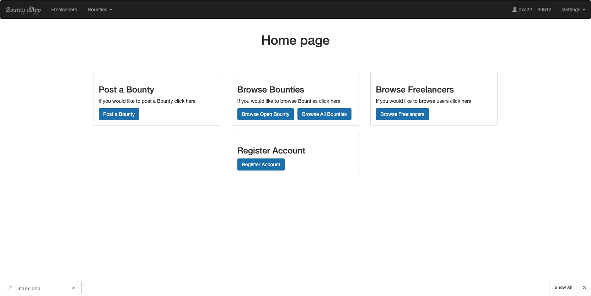
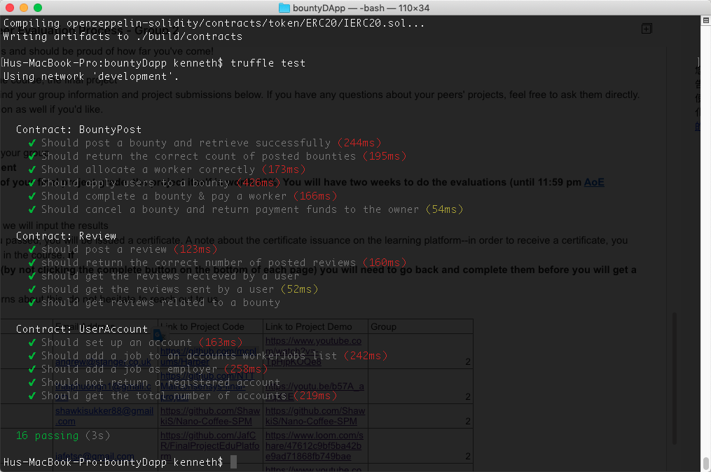
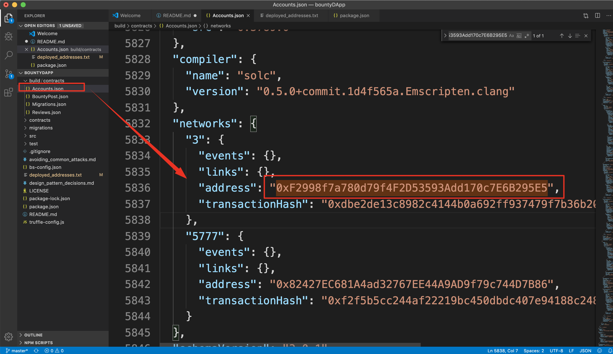

# Bounty dApp
Description: Create a bounty dApp where people can post or submit work.

 
## User Stories:
As a job poster, I can create a new bounty. I will set a bounty description and include the amount to be paid for a successful submission. I am able to view a list of bounties that I have already posted. By clicking on a bounty, I can review submissions that have been proposed. I can accept or reject the submitted work. Accepting proposed work will pay the submitter the deposited amount.
 
As a bounty hunter, I can submit work to a bounty for review.


## 1. Features

The application lets any user create a bounty with a reward or submit a solution for an open bounty. It has the following features:

- A bounty creator can create a bounty entering a bounty description,uploading a document on IPFS and setting a bounty reward in ETH
- Any user can browse through the existing bounties, see the bounty problem statement, compare the bounty rewards and submit a solution for an open bounty
- Any user can view their account to see the status of their created bounties, go through the submitted solutions and accept a solution and reviews which people submit.
- The bounty creator can complete/cancel the bounty. The owner/administrator of the application/smart contracts cannot complete/cancel the application
- Once the bounty creator confirm the bounty, the bounty reward will automatically be transferred to worker. On the other hand, the bounty creator cancel the bounty, the bounty reward will be returned to the bounty creator.


## 2. Setup

To run the application locally, follow the steps,

Clone the repo

``` git clone https://github.com/kennethhutw/bountyDApp/ ```

Install the packages required

``` npm install  ```

Start ganache-cli on port 8545

``` ganache-cli ```

Make sure you have Metamask installed and import the accounts provided by ganache-cli by importing with the seed phrase

Compile and deploy the smart contracts

``` truffle compile ```

``` truffle migrate --reset ```

Run the script to serve the application on port 3000

``` npm run dev ```

MetaMask can be installed from the [Metamask](https://metamask.io/)


The DApp is also deployed on the Rospten Test Network, and static assets hosted on IPFS.

## 3. Tests

To run the tests, run the following command

``` truffle test ```




## 4. Design Pattern Desicions

For all the design pattern desicions, please see [design pattern desicions](./design_pattern_decisions.md)

## 5. Avoiding Common Attacks

For the steps taken to avoid known common attacks, please see [avoiding common attacks](./avoiding_common_attacks.md)

## 6. Deployed Addresses

the smart contracts were deployed on the Rospten Test Network. 

[Demo site] (https://bountydapp-f7e4a.firebaseapp.com/account.html)

[Video] (https://www.youtube.com/watch?v=eWcFu9NKDW8&t=7s)

Or you can replace the address of json file in contract folder as below figure. 


-- Ropsten
Accounts.sol - contract address:    0xF2998f7a780d79f4F2D53593Add170c7E6B295E5

BountyPost.sol -
contract address:    0x858CBcc2fEB3d9D372215c29b3e929C981AB1618

Reviews.sol -
contract address: 0xAB5408fE087ec8db4577663133a13d0b028D56A9




